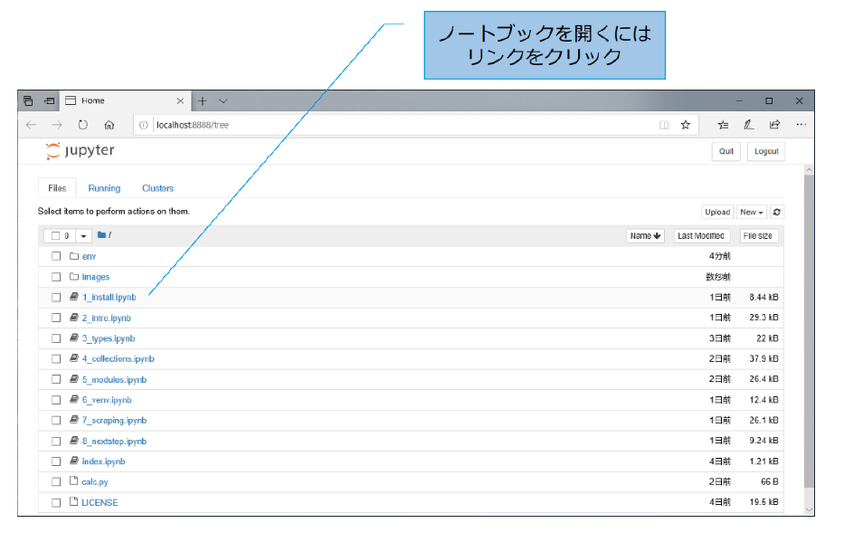

# Python と Jupyter のインストールと実行

## やることリスト

* Python のインストール
* venv 環境の構築
* Jupyter のインストール

(Windows向けに環境設定用動画を用意しました。<https://youtu.be/PolWSm7-tiY>)

# Python のインストール

## Python 入ってますか？

Windows には Python が入っていませんが、Mac OS や Linux には Python が入っています。

まずは、インストール済みの Python のバージョンを確認します。
コマンドプロンプト(Windows)などの環境で、 `python -V`と入力します。

今回は Python3.6 を使用します。今回の学習環境では conda 向けには書いてありません。公式の Python での説明になっています。


## Windows の場合(コマンドプロンプト)

```bat
C:\Users\Taro>python -V
Python 2.7.15
```

上記は python 2.7.15 を示しています。

## macOS / Linux の場合

```bash
$ python -V
Python 2.7.15
```

python 3.x.x がインストールされている場合、python3 というコマンドになっている場合があります。

```bash
$ python3 -V
Python 3.6.7
```

## Python のインストール(Windows 版)

Windows で Python を利用する場合は、Python の公式サイトで配布されている Windows インストーラを利用します。

2019 年 1 月現在の最新バージョンは 3.7.2 ですが、互換性の問題があるライブラリがあるため、ここでは 3.6.7 を使用します。

「 Python Release Python 3.6.7 」（<https://www.python.org/downloads/release/python-367/>）をブラウザで開きます。  
OS によって以下のいずれかのインストーラーをダウンロードし、ウィザードに従ってインストールします。

* 64 ビット版: [Windows x86-64 executable installer](https://www.python.org/ftp/python/3.6.7/python-3.6.7-amd64.exe)
* 32 ビット版: [Windows x86 executable installer](https://www.python.org/ftp/python/3.6.7/python-3.6.7.exe)

##### Add Python 3.6 to PATH

この時、「Add Python 3.6 to PATH」にチェックを入れておきましょう。自動的に必要な環境変数が設定されます。


画像は 3.3.6 になっていますが、3.6.7 も同様

## Python のインストール(macOS 版)

Mac OS で Python3 をインストールする方法には、Python の公式サイトで配布されている MacOS インストーラを利用する方法と、オープンソースのパッケージ管理ツールである Homebrew（または MacPort）を利用する方法があります。

ここではインストーラを使う方法を紹介します。
2019 年 1 月現在の最新バージョンは 3.7.2 ですが、互換性の問題があるライブラリがあるため、ここでは 3.6.7 を使用します。
「 Python Release Python 3.6.7 」（<https://www.python.org/downloads/release/python-367/>）をブラウザで開きます。

OS によって以下のいずれかのインストーラーをダウンロードし、ウィザードに従ってインストールします。

* 10.9 以降: [macOS 64-bit installer](https://www.python.org/ftp/python/3.6.7/python-3.6.7-macosx10.9.pkg)
* 10.6 以降: [macOS 64-bit/32-bit installer](https://www.python.org/ftp/python/3.6.7/python-3.6.7-macosx10.6.pkg)

## Python のインストール(Linux 版)

Linux ではディストリビューションのパッケージマネージャ(yum, apt 等）で Python3.6 をインストールします。

ディストリビューション（バージョン）によっては、ソースからのコンパイルが必要です。

## Python のドキュメント

下記の URL に日本語の Python3.6.5 のドキュメントがあります。

<https://docs.python.jp/>

## 確認 ✔

コマンドプロンプトなどから、Python のバージョンを確認して 3.6.7 と表示されること

Windows

```bat
C:\Users\Taro>python -V
Python3 3.6.7
```

macOS / linux

```bash
$ python3 -V
Python3 3.6.7
```

# venv 仮想環境の構築

## venvとは?

Pythonには機械学習ライブラリを含む様々なオープンソースのライブラリが存在し、パッケージとして提供されています。

ひとつのPythonランタイムを、別々のプロジェクトで共用した場合、それぞれのプロジェクトのライブラリのバージョンが競合する可能性があります。


Pythonランタイムから、プロジェクトごとにライブラリ保管場所を作るツールがvenvです。

venvを使うことで、ひとつのPythonランタイムから、クリーンなPython環境を複数作成できます。

このように作成されたPython環境を「仮想環境」と呼びます


## venvで仮想環境をつくる

コマンドプロンプトで下記のように入力します。

環境によってPython3.6がpython3のようになっている場合があります。

```
python –m venv 仮想環境フォルダ名
```

Windows
```bat
C:\Users\Taro>python -m venv myvenv
```

macOS / linux
```bash
$ python3 -m venv myvenv
```

## 仮想環境のアクティブ化

仮想環境をアクティブにすることで、仮想環境内のPythonを使うようになります。

仮想環境を有効化するとコマンドプロンプトの前に仮想環境名が（）内に表示されます。

この状態で後述するパッケージマネジャーコマンドpipを使ってライブラリを管理します。

Windows
```bat
C:\Users\Taro>myvenv\Scripts\activate

(myenv) C:\Users\Taro>
```

macOS / linux
```bash
$ source myenv/bin/activate
(myenv) $
```

## 仮想環境の無効化

仮想環境を無効化するには`deactivate`コマンドを実行します。

仮想環境から離脱してグローバルなPythonを使う形に戻ります。

Windows
```bat
(myenv) C:\Users\Taro>deactivate
C:\Users\Taro>
```

macOS / linux
```bash
(myenv) $ deactivate
$
```

## (補足)Anaconda環境の場合

Anacondaディストリビューションの場合、パッケージ管理と仮想環境の管理を行うcondaというコマンドを使います。

```
$ conda create --name myvenv python # 環境を作成 
$ source activate myvenv # 環境の有効化 
(myvenv) $ conda install requests # パッケージのインストール 
(myvenv) $ source deactivate # 環境の無効化
```

## pipとは？

pipはPython3に標準で付属するライブラリパッケージの管理ツールです。

インターネット上のリポジトリにあるライブラリパッケージをダウンロードしてインストールできます。

ライブラリ同士の依存関係を管理しており、ライブラリに必要な他のライブラリも自動的にダウンロードしてインストールします。

## pipの使い方 - 主なコマンド

ライブラリのインストール
`pip install パッケージ名`

バージョンを指定してインストール
`pip install パッケージ名==バージョン`

パッケージのアップグレード
`pip install パッケージ名 --upgrade`

パッケージの検索
`pip search 検索ワード`

インストール済みパッケージの一覧
`pip list`

パッケージのアンインストール
`pip uninstall パッケージ名`


## 確認 ✔

* 仮想環境 hogeの作成 アクティブ化
* ライブラリ requestsのインストール
* インストールされたライブラリの一覧を確認
* 仮想環境 hogeの無効化ができること

(確認後は、使用しないのでhogeディレクトリを削除してOK)

Windows
```bat
C:\Users\Taro> python -m venv hoge
C:\Users\Taro> hoge\Scripts\activate

(hoge) C:\Users\Taro> pip install requests
...
Successfully installed ...
(hoge) C:\Users\Taro> pip list
...
requests   2.21.0
...

(hoge) C:\Users\Taro> deactivate
C:\Users\Taro> deactivate
```

macOS / linux
```bash
$ python3 -m venv hoge
$ source hoge/bin/activate
(hoge) $ pip install requests
...
Successfully installed ...
(hoge) $ pip list
...
requests   2.21.0
...

(hoge) $ deactivate
$ 
```

# Jupyterのインストール

Webブラウザ上のPython開発・実験環境

## Jupyterとは？

JupyterはWebブラウザ上でPythonプログラムの編集・実行ができるツールです。

実行中は変数やオブジェクトがKernelというプロセスの中に保持されるため、インタラクティブなプログラム開発ができます。

Notebookと呼ばれるファイルには、プログラムだけではなく、ブログで使われているMarkdown と呼ばれる簡易記法によりドキュメントが記述でき、数式もLaTex記法によりきれいに表示できます。

文字だけではなく、グラフや画像などのプログラムの出力もNotebookに保存できます。

NotebookはHTMLやTeX、PDFなどの形でダウンロードできます。

## Jupyterのインストール

Jupyterはpipコマンドでインストールできます。Jupyterに必要な様々なライブラリも自動的にインストールされます。


* 今回の勉強会用の仮想環境 python-ml-env を作成
* アクティブにして仮想環境にJupyterをインストール

Windows
```bat
C:\Users\Taro> python -m venv python-ml-env
C:\Users\Taro> python-ml-env\Scripts\activate
(python-ml-env) C:\Users\Taro> pip install jupyter
```

Linux / macOS
```
$ python –m venv python-ml-env
$ source python-ml-env/bin/activate
(python-ml-env) $ pip install jupyter
```

## Python入門教材のダウンロード

今回使用するテキストはJupyter Notebookとなっています。

下記のURLからダウンロードしzipファイルを展開します。

<https://github.com/civic/pycamp-notebooks>


## Jupyterの起動

JupyterでNotebookを使うには、Pythonの仮想環境でZIPファイルを解凍したディレクトリで、下記のコマンドを実行します。

```
jupyter notebook
```

プログラムが起動すると、起動したパソコン上のポート番号5000版でサーバーが起動し、既定のWebブラウザが起動されてこのサーバー使ってファイル一覧ページが表示されます。



## 確認 ✔

Jupyterが起動し、ブラウザでzipファイルを展開したディレクトリのファイル一覧が表示されること。

## 新規ノートブックを作成


## セルの選択 (マークダウンセル)


## セルの選択（コードセル)


## ツールバー


## セルの編集 (マークダウンセル)

セルを「実行」すると、Markdownが解釈され書式が適用されます。


セルを実行するには、「Run」ボタンをクリックするか、Ctrl + Return あるいはShift + Returnを入力します。

RunボタンあるいはShift + Returnではカレントセルが下に移ります。

## セルの編集 (コードセル)

セルを「実行」すると、Pythonプログラムが実行され、出力があれば表示されます。


セルを実行するには、「Run」ボタンをクリックするか、Ctrl + Return あるいはShift + Returnを入力します。

RunボタンあるいはShift + Returnではカレントセルが下に移ります。

## 実行中のJupyter Serverと停止


## Jupyterの認証機能

既定では起動時に生成されたトークンで認証が行われます。 パスワードを設定することも可能です。

パスワード認証を設定するには起動時に以下のように下記のコマンドを入力します。

```
$ jupyter notebook password
```

## Jupyter関連情報

* デフォルトブラウザ以外のブラウザを起動
    * Windows環境でのJupyter Notebookのブラウザ指定  
    <https://qiita.com/acknpop/items/4e5b57e38780068a9155>
    * Jupyter Notebookで使うブラウザを指定する。特にMac。 （とVivaldi）  
    <https://qiita.com/nannoki/items/315a12a8700c1ca92da3>
* パスワード設定  
    * `$ jupyter notebook --generate-config`  
    * `$ jupyter notebook password`
* Markdown記法
    * かんたんMarkdownの記法  
    <https://tatesuke.github.io/KanTanMarkdown/syntax.html>
* 数式記法(Jupyter 公式ドキュメント） 
    * <https://jupyter-notebook.readthedocs.io/en/latest/examples/Notebook/Typesetting%20Equations.html>
* 拡張機能（Jupyter Extentions）
    * [作業効率化] Jupyterの拡張機能を全部調べてみた  
    <https://qiita.com/simonritchie/items/88161c806197a0b84174>
* 日本語PDF出力
    * 日本語のJupyter NotebookをPDFとしてダウンロードする  
    <https://qiita.com/masa-ita/items/8d5ebe8afe0d580af184>

## （補足）機械学習関連ライブラリのインストール

画像分類のハンズオンで使用するライブラリを、この仮想環境python-ml-envにあからじめインストールしておくと、
ハンズオンの進行がスムーズになると思います。

* tensorflow
* keras
* pillow
* matplotlib 

```bat
(python-ml-env) C:\Users\Taro> pip install tensorflow keras pillow matplotlib
```

